# Mall示例应用简介

Mall示例使用SnapDevelop 2026开发，展示如何通过可视化设计器，实现商城：

- 后端数据库、服务API
- PC前端商城后台管理页面

- 移动端前端H5、Uniapp

## 一、项目

### 1.项目结构

解决方案中存在三个Project：

- **Mall_Mobile**：移动终端视图设计项目

- **Mall_PC**：PC端商城后台管理视图设计项目

- **Mall_Services**：纯后端实体逻辑设计项目

   

### 2. 生成代码

三个项目分别选择生成如下代码：

- **Mall_Mobile**：生成H5或Uniapp代码

- **Mall_PC**：生成PC-Vue3代码

- **Mall_Services**：生成服务端代码

    
  
  生成的前后端代码结构如下
  
   

### 3. 运行

1. 先运行WebApi，创建数据库和启动后端服务接口（可将data.db拷贝到WebApi运行，该数据库文件携带测试数据）

    

2. 后运行Mall_PC后台管理前端，在这里进行商品的上传和管理等

3. 再运行H5或选择在HBuilderX中运行Uniapp，浏览移动端效果

## 二、功能介绍

### 1. PC端后台管理

在后台管理中主要进行商品的管理：

- 商品管理：上传商品、编辑商品、上传详情图片、查看商品详情

- 商品类别管理：商品类别的管理

- 首页商品管理：移动端首页中轮播图中展示的商品

- 订单查看：订单的管理

- 评论查看：所有评论的查看

- 用户管理：用户的管理

  

### 2. 移动端

移动端Layout菜单栏有五项：首页、分类、购物车、订单、我的

##### 1）首页

**首页**展示商品。

- 顶部轮播展示置顶商品的图片
- 中间搜索输入，过滤商品
- 底部两列布局展示所有商品

- 点击搜索框，跳转到新页面-**商品搜索页面**，过滤搜索。参考常见商城app：使用双列布局展示商品，搜索后单列展示
- 点击商品卡片，跳转到**商品详情页面**
- 商品详情页，顶部展示商品的图片、名称、详情、价格
- 点击心形图标、进行商品的收藏、取消收藏
- 中部展示商品详情图片（五张）
- 底部展示商品评论（这里只展示三条评论），商品所有评论数量，点击跳转**所有评论页面**，可以新增评论
- 底部固定按钮：首页（返回首页）、购物车（展示数量、点击跳转购物车页面）、加入购物车（商品加入购物车，抽屉）

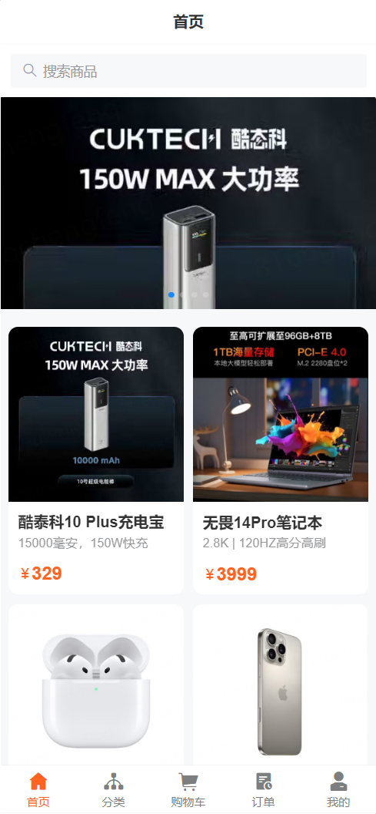 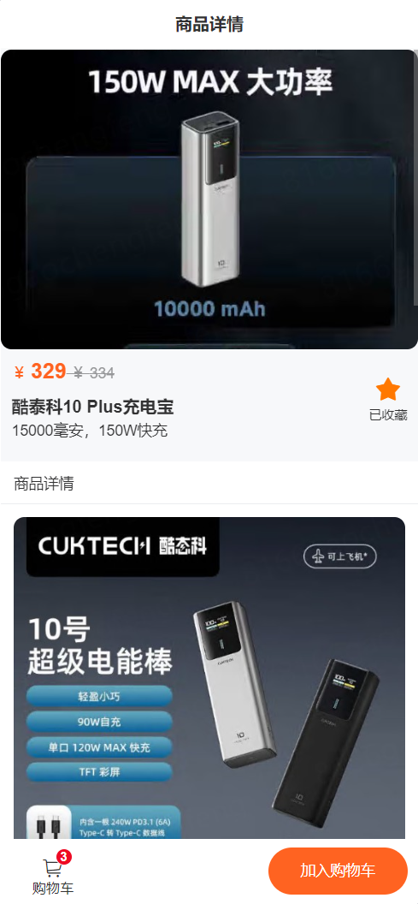

##### 2）分类

展示所有分类，并根据侧边栏所选分类，在右侧显示该分类下的所有的商品。

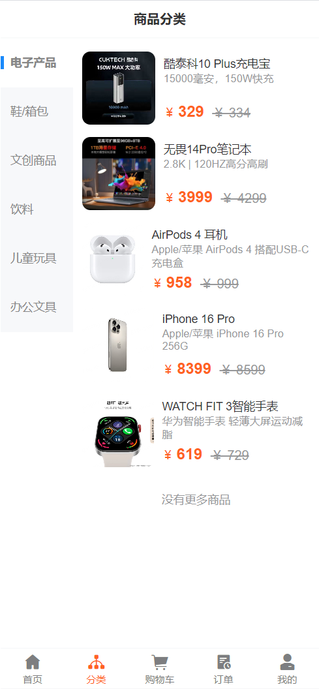  

##### 3）购物车

展示加入购物车的商品。

- 列表展示购物车商品信息、勾选状态、数量
- 点击购物车商品单选框，实时更新状态为已选择、未选择
- 点击购物车商品数量，实时更新商品数量
- 点击商品名称，跳转商品详情页面
- 底部固定结算栏，**全选**：将所有商品状态更改为已选择；不全选：将所有商品状态更改为为选择
- **合计金额**，实时将已选商品的合计金额计算显示
- **去结算**，只有已选商品数量不为0时，才显示，否则隐藏，实时变化
- **管理**，点击跳转**购物车管理页面**，对购物车商品进行批量删除

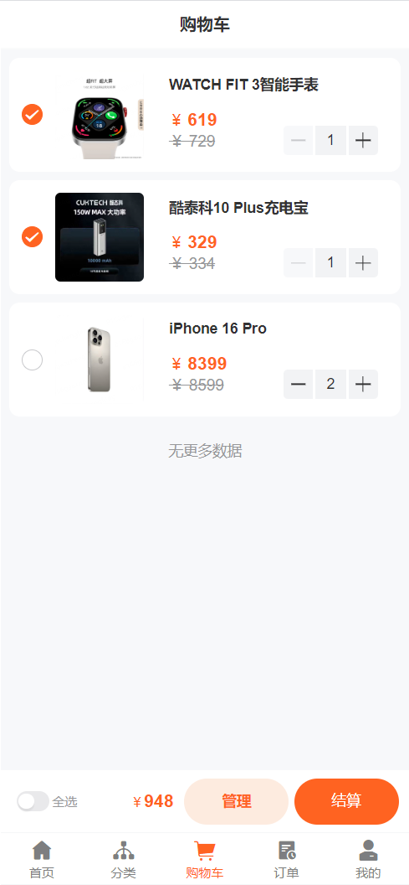  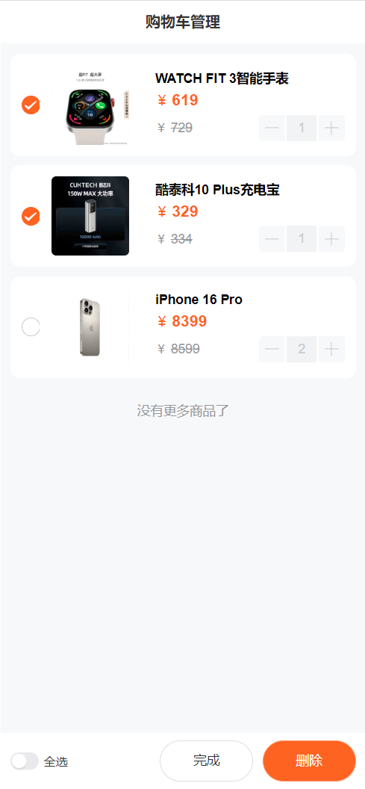 

- **去结算**，点击去结算按钮，跳转到**结算页面**
- 点击切换地址，下拉抽屉切换收货地址
- 商品列表展示购物车页面中选中要结算的商品
- 商品数量、订单金额、已优惠金额、实付金额的显示
- 点击提交订单之后，默认生成待支付订单

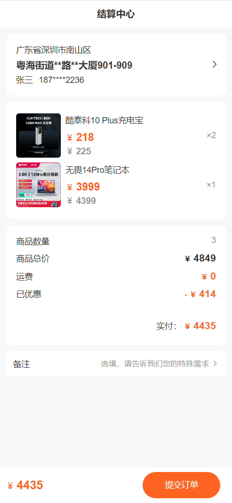   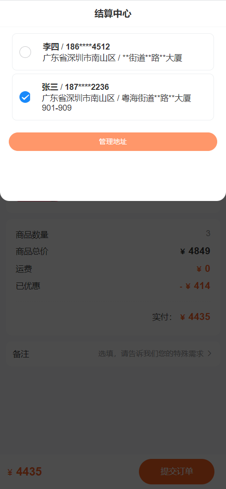 

##### 4）订单

该页面用Tab展示五个状态的订单：待付款、待收货、待评价、已完成、已取消

- 待付款：提交订单后的默认状态

- 待收货：点击继续支付并确认后，状态更新为待收货

- 待评价：点击确认收货并确认后，状态更新为待评价。

  在待评价订单中，点击评价，弹出抽屉显示该评价商品，需要根据单个进行商品评价。

  商品评价页面。

- 已完成：在待评价的订单中，点击已完成，手动更新该订单状态为已完成。

  在已完成订单中，申请售后。添加售后订单，售后状态可选：退货退款、换货、退款(不退货)

- 已取消：已取消状态的订单。

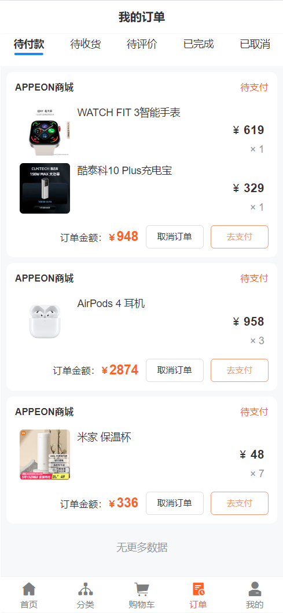 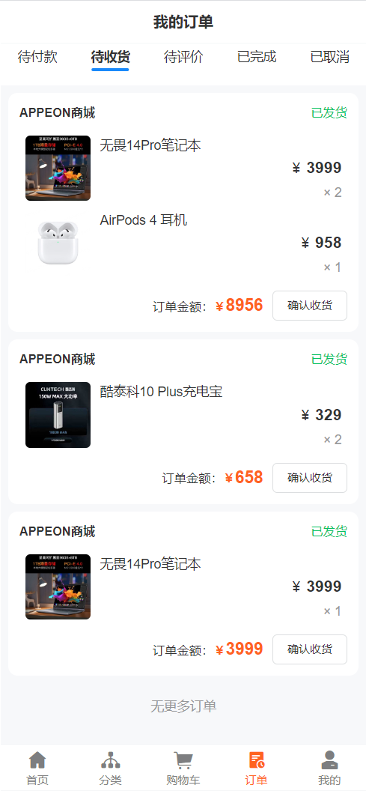 

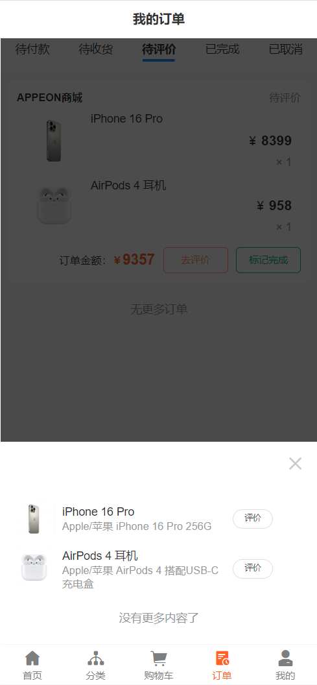   

##### 5）我的

展示用户信息页面。

- 我的收藏：已收藏的商品，在商品详情中收藏/取消收藏
- 我的订单
- 退款/售后：在已完成状态订单中申请售后的商品
- 收货地址：地址的新增、编辑和删除

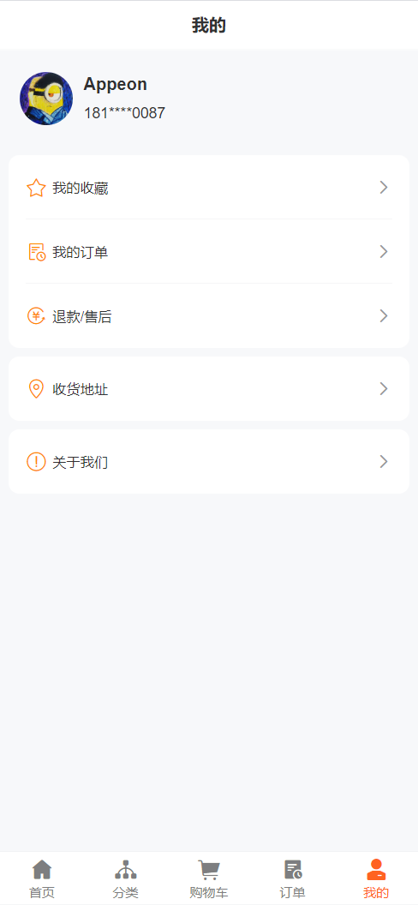  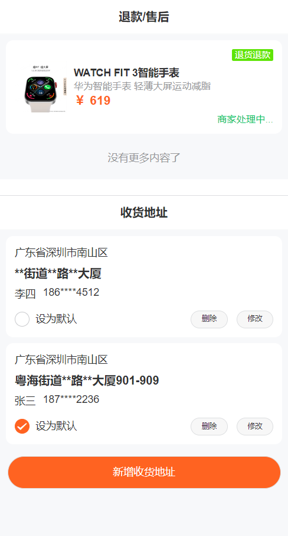    

------

# 更多信息
关于本商城示例应用中包含的功能以及功能的详细设计过程，请参见[项目设计文档](/项目设计文档.md)。

如需下载最新版本的 SnapDevelop，欢迎访问：[https://www.aipuyang.com](https://www.aipuyang.com)。

如需了解更多关于 SnapDevelop 的使用信息，欢迎访问：[https://docs.aipuyang.com](https://docs.aipuyang.com)。
 