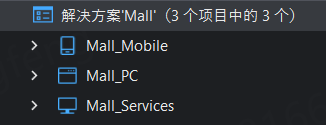
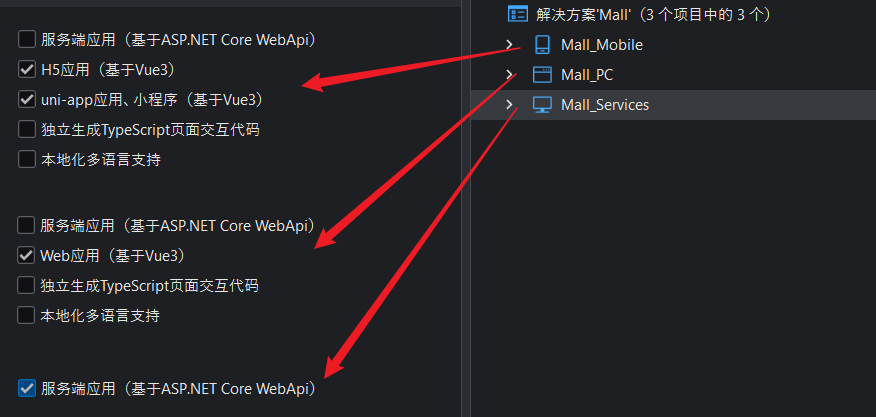
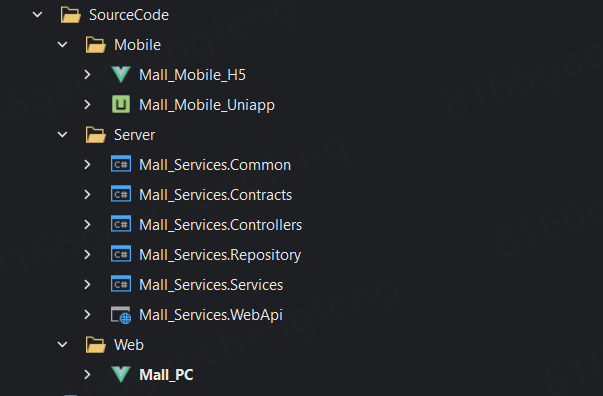
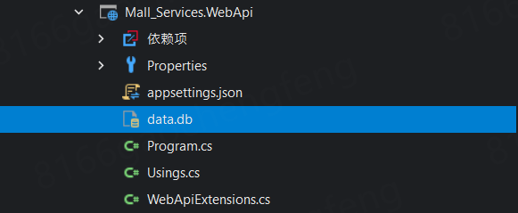

# 商城示例应用简介

本商城示例应用使用SnapDevelop 2026开发，展示如何通过可视化设计器，实现商城：

- 后端数据库、服务API
- PC前端商城后台管理页面
- 移动端前端H5、uniapp

## 1.项目结构

解决方案中存在三个设计器项目（即SnapDevelop中独有的低代码开发项目）：

- **Mall_Mobile**：移动终端视图设计项目

- **Mall_PC**：PC端商城后台管理视图设计项目

- **Mall_Services**：纯后端实体逻辑设计项目

   

## 2. 生成代码

在从设计器项目生成标准项目代码时，三个项目分别选择生成如下类型代码：

- **Mall_Mobile**：生成H5或uniapp代码

- **Mall_PC**：生成PC-Vue3代码

- **Mall_Services**：生成服务端代码

    
  
  生成的前后端代码结构如下
  
   

## 3. 运行

1. 先运行WebApi，创建数据库和启动后端服务接口（可将data.db拷贝到WebApi运行，该数据库文件携带测试数据）

    

2. 后运行Mall_PC后台管理前端，在这里进行商品的上传和管理等

3. 再运行H5或选择在HBuilderX中运行Uniapp，浏览移动端效果

# 更多信息
关于本商城示例应用中包含的功能以及功能的详细设计过程，请参见[项目设计文档](/设计文档.md)。

如需下载最新版本的 SnapDevelop，欢迎访问：https://www.aipuyang.com。

如需了解更多关于 SnapDevelop 的使用信息，欢迎访问：https://docs.aipuyang.com.
