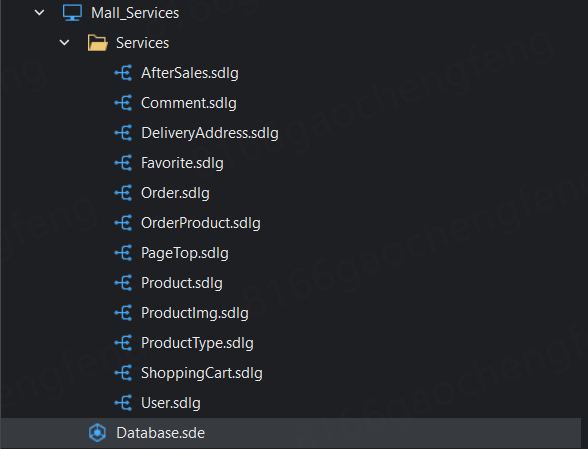
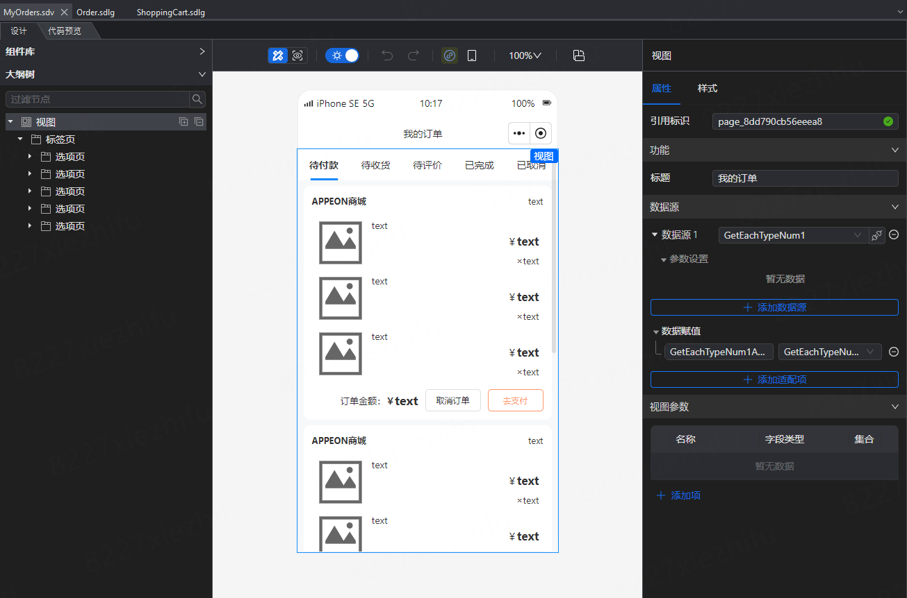
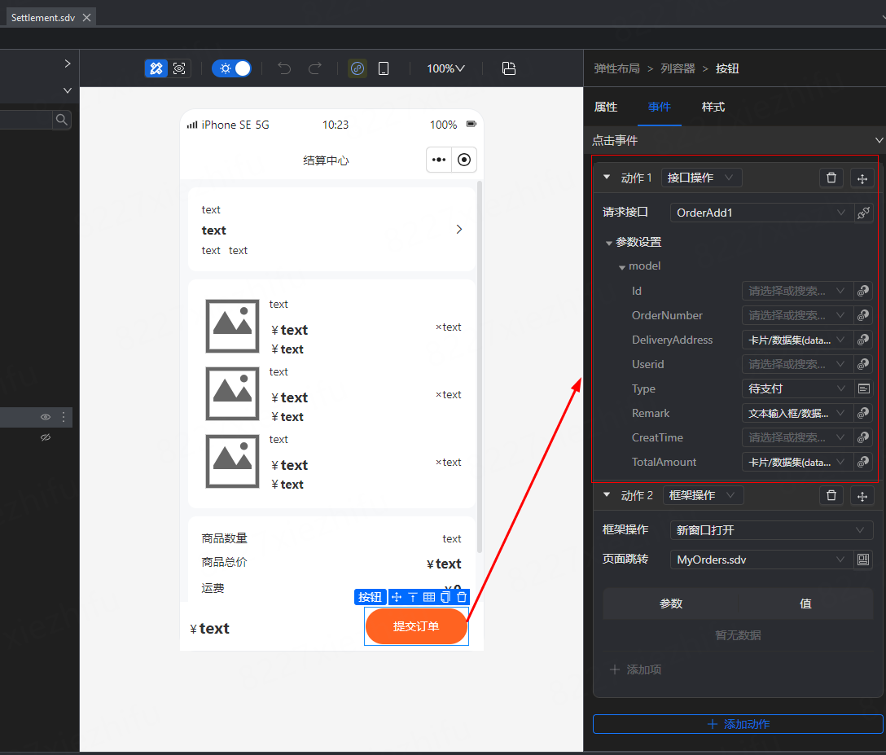
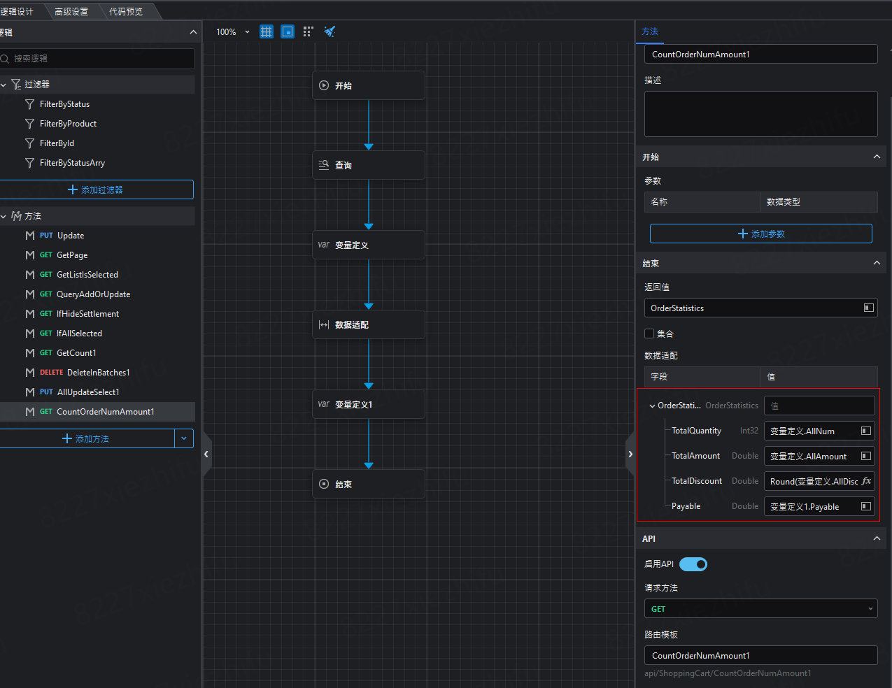
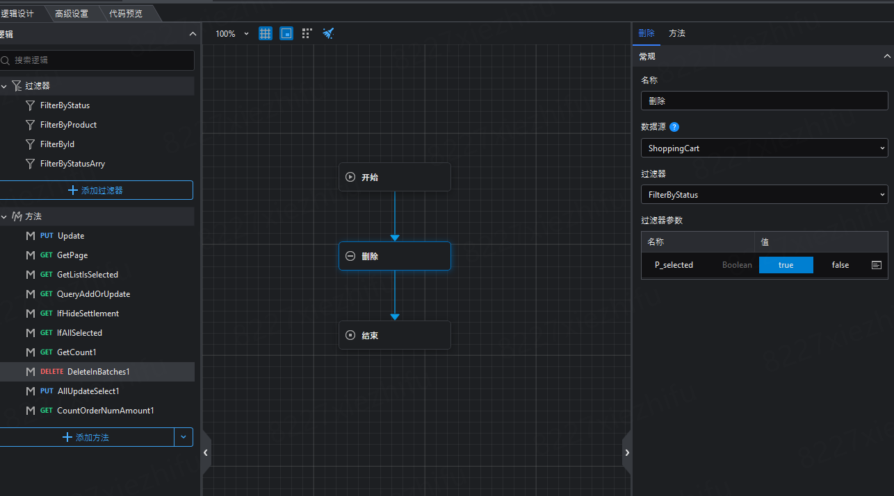

### 一、概述

本文主要介绍Github Demo商城项目的功能和详细设计过程（实体、逻辑、视图）。

------

### 二、项目

#### 1. 项目结构

解决方案中存在三个Project：

- **Mall_Mobile**：移动终端视图设计项目

- **Mall_PC**：PC端商城后台管理视图设计项目

- **Mall_Services**：纯后端实体逻辑设计项目

 

注意：Mall_Mobile和Mall_PC必须将Mall_Services**添加到项目引用**，才能在视图中识别引用Mall_Services中实体和逻辑

   

#### 2. 生成代码

三个项目分别选择生成如下代码：

- **Mall_Mobile**：生成H5或Uniapp代码

- **Mall_PC**：生成PC-Vue3代码

- **Mall_Services**：生成服务端代码

 

#### 3. 运行

- 先运行后端服务api
- 再运行PC-Vue3的后台管理前端，在这里进行商品等的上传和管理
- 最后运行H5或选择在HBuilderX中运行Uniapp，查看移动端效果

------

## 二、功能介绍

### 1. PC端后台管理

在后台管理中主要进行商品的管理：

- 商品管理：上传商品、编辑商品、上传详情图片、查看商品详情

- 商品类别管理：商品类别的管理

- 首页商品管理：移动端首页中轮播图中展示的商品

- 订单查看：订单的管理

- 评论查看：所有评论的查看

- 用户管理：用户的管理

  

### 2. 移动端

移动端Layout菜单栏有五项：首页、分类、购物车、订单、我的

##### 1）首页

**首页**展示商品。

- 顶部轮播展示置顶商品的图片
- 中间搜索输入，过滤商品
- 底部两列布局展示所有商品

- 点击搜索框，跳转到新页面-**商品搜索页面**，过滤搜索。参考常见商城app：使用双列布局展示商品，搜索后单列展示
- 点击商品卡片，跳转到**商品详情页面**
- 商品详情页，顶部展示商品的图片、名称、详情、价格
- 点击心形图标、进行商品的收藏、取消收藏
- 中部展示商品详情图片（五张）
- 底部展示商品评论（这里只展示三条评论），商品所有评论数量，点击跳转**所有评论页面**，可以新增评论
- 底部固定按钮：首页（返回首页）、购物车（展示数量、点击跳转购物车页面）、加入购物车（商品加入购物车，抽屉）

 

##### 2）分类

展示所有分类，并根据侧边栏所选分类，在右侧显示该分类下的所有的商品。

  

##### 3）购物车

展示加入购物车的商品。

- 列表展示购物车商品信息、勾选状态、数量
- 点击购物车商品单选框，实时更新状态为已选择、未选择
- 点击购物车商品数量，实时更新商品数量
- 点击商品名称，跳转商品详情页面
- 底部固定结算栏，**全选**：将所有商品状态更改为已选择；不全选：将所有商品状态更改为为选择
- **合计金额**，实时将已选商品的合计金额计算显示
- **去结算**，只有已选商品数量不为0时，才显示，否则隐藏，实时变化
- **管理**，点击跳转**购物车管理页面**，对购物车商品进行批量删除

   

- **去结算**，点击去结算按钮，跳转到**结算页面**
- 点击切换地址，下拉抽屉切换收货地址
- 商品列表展示购物车页面中选中要结算的商品
- 商品数量、订单金额、已优惠金额、实付金额的显示
- 点击提交订单之后，默认生成待支付订单

    

##### 4）订单

该页面用Tab展示五个状态的订单：待付款、待收货、待评价、已完成、已取消

- 待付款：提交订单后的默认状态

- 待收货：点击继续支付并确认后，状态更新为待收货

- 待评价：点击确认收货并确认后，状态更新为待评价。

  在待评价订单中，点击评价，弹出抽屉显示该评价商品，需要根据单个进行商品评价。

  商品评价页面。

- 已完成：在待评价的订单中，点击已完成，手动更新该订单状态为已完成。

  在已完成订单中，申请售后。添加售后订单，售后状态可选：退货退款、换货、退款(不退货)

- 已取消：已取消状态的订单。

  

   

##### 5）我的

展示用户信息页面。

- 我的收藏：已收藏的商品，在商品详情中收藏/取消收藏
- 我的订单
- 退款/售后：在已完成状态订单中申请售后的商品
- 收货地址：地址的新增、编辑和删除

       

------

### 四、后端服务-实体设计

#### 1. 实体设计

- **Product**

  商品表。

- **ProductType**

  商品种类表。

- **PageTop**

  需要展示在首页的商品表。

- **Comment**

  商品的评论表。

- **ProductImg**

  商品详细图片表。

- **ShoppingCart**

  购物车表。

- **Favorite**

  商品收藏表。

- **User**

  用户表。

- **Order**

  订单表。

- **OrderProduct**

  订单商品表。

- **DeliveryAddress**

  收货地址表。

- **AfterSales**

  售后表。

 

#### 2. 枚举设计

设计了两个枚举。

- **OrderType**：订单状态

- **AfterSalesType**：售后状态

  

#### 3. 逻辑设计

根据每个实体生成默认的CURD逻辑，特殊的场景逻辑设计在试图设计的场景中附带详细介绍。

 

------

### 五、PC前端后台管理-视图设计

#### 1. 整体视图结构

 

------

### 六、Mobile前端-视图设计

移动端视图的设计讲解。

#### 1. 整体视图文件结构

各个文件夹下视图文件介绍。⭐标注为主要视图文件。

> Views

- ⭐Category.sdv：商品分类展示
- Layout.sdv：布局
- My.sdv：我的管理页面
- ⭐ShoppingCart.sdv：购物车页面
- ⭐TopPage.sdv：首页

> Address

- Add.sdv：新增收货地址
- Edit.sdv：编辑收货地址
- SelectAddress.sdv：收货地址列表

> AfterSales

- Add.sdv：新增售后
- Completed.sdv：新增成功的反馈页面
- OrderProduct.sdv：展示需要处理售后订单的商品列表，在已完成订单中调用该页面新增

> Comment

- AddComment.sdv：新增评论
- CommentCompleted.sdv：新增评论成功的反馈页面
- ProductAllComments.sdv：商品的所有评论

> MinePage

- About.sdv：关于
- ⭐Address.sdv：我的收货地址，修改默认地址
- AfterSales.sdv：售后状态的商品列表
- MyFavorites.sdv：我的收藏商品
- ⭐MyOrder.sdv：我的订单

> Order

- Comments.sdv：订单商品的评价，在待评价页面的抽屉视图容器中引用
- OrderAwaitEvaluation.sdv：待评价的订单页面
- OrderCancelled.sdv：已取消的订单页面
- OrderCompleted.sdv：已完成的订单页面
- OrderTobePayed.sdv：待支付的订单页面
- OrderTobeReceived.sdv：待收货的订单页面
- ⭐Settlement.sdv：结算页面，在购物车结算按钮事件引用 

> Product

- ⭐ProductDetail.sdv：商品详情页面
- SearchProduct.sdv：商品搜索页面

> ShoppingCart

- Manage.sdv：购物车管理，批量删除

 

#### 2. 主要视图的设计

六个主要视图的设计。

##### 1）首页-TopPage

三个组件：轮播图、弹性布局（内有输入搜索框）、列表，从上而下排列布局

- 轮播图：数据源配置PageTop.GetList

- 弹性布局（内有输入搜索框）：配置点击事件，跳转搜索商品页面

- 列表

  - 数据源配置ShoppingCart.GetPage

  - 启用栅格，列数为2
  - 列表项全新设计，使用卡片，嵌套弹性布局配置成商品展示效果
  - 卡片点击事件，配置跳转到商品详情页ProductDetail.sdv，携带列表当前行商品id绑定到详情页的视图参数

 

##### 2）商品详情-ProductDetail

视图数据源配置初始接口数据：

- Product.Get，过滤的商品id来源于视图参数。结果赋值到GetAdapter，字段绑定到商品的图片、名称、价格等展示
- ShoppingCart.GetCount。逻辑接口返回购物车的数量，绑定到数字输入框，数字输入框再作为成员变量绑定到购物车徽标数显示数量。主要是需要再本商品加入购物车后，数量有变化时，重新访问接口获取数据，绑定到成员变量，徽标数量能够实时变化
- Comment.GetNum。逻辑接口返回当前商品的评论数量。
- Favorite.Judge。逻辑接口返回该商品是否已被收藏，图标颜色配置值转换器，根据接口返回值匹配颜色

从上到下布局的组件设计：

- 图片：绑定商品图片显示

- 弹性布局：商品其他信息的显示，是否收藏的显示

- 数字输入框：中间件，隐藏，成员变量用于绑定接收购物车数量

- 抽屉：点击加入购物车显示，配置商品加入购物车的表单提交

- 对话框：收藏/取消收藏的提示

- 弹性布局：底部（首页/购物车/加入购物车）布局的固定，需要在样式中设置位置为**固定定位**，button设置0则贴到底部

  - 点击首页，跳转返回首页

  - 点击购物车，跳转购物车

  - 点击加入购物车，弹出抽屉，将商品加入购物车

     

- 卡片：数据源配置ProductImg.GetByProduct，显示五张详细图片

- 卡片：数据源配置Comment.GetPageByProduct，PageSize手动赋值为3，该页面只显示3个评论

  - 卡片右上角展示评论数量，绑定到视图数据源的数据赋值CommentNum

 

 

##### 3）商品分类-Catogory

视图数据源配置初始接口数据：

- 无

从左到右布局的组件设计：

- 侧边栏：数据源配置ProductType.GetList，显示所有类别
- 列表：数据源配置Product.GetPageByFilter，参数product_type配置绑定侧边栏选中项的成员变量，列表过滤显示该分类下的所有商品

 

##### 4）购物车-ShoppingCart

视图数据源配置初始接口数据：

- ShoppingCart.CountOrderNumAmount，获取已选购物车商品的总金额显示
- ShoppingCart.IfHideSettlement，返回购物车已选商品是否>0，用于控制“去结算”按钮的显示
- ShoppingCart.IfAllSelected，返回购物车是否全选的判断结果，控制“全选”开关的初始值

从上到下布局的组件设计：

- 列表：数据源配置ShoppingCart.GetPage，加载显示所有购物车商品
  - 购物车商品的详细详细显示使用卡片接受，特别是购物车的选中状态、商品数量分别用多选框和步进器绑定显示
  - 点击多选框和步进器，触发卡片的接口，更新购物车该商品的选中状态和数量
- 数字输入框：中间件，隐藏，成员变量用于绑定接收购物车已选商品的计算金额，实时显示
- 开关：中间件，隐藏，成员变量用于绑定接收购物车是否存在已选择，绑定控制“去结算”按钮的隐藏
- 弹性布局：固定在上方的（管理），样式中使用固定定位，点击事件配置跳转到购物车管理界面，可进行购物车的批量删除
- 弹性布局：固定在下方的（全选/合计金额/去结算），样式中使用固定定位，全选、合计金额绑定成员变量实时显示

 

##### 5）结算-Settlement

视图数据源配置初始接口数据：

- 无

从上到下布局的组件设计：

- 卡片：收货地址
  - 配置数据源DeliveryAddress.GetDefaultAddr，获取默认收货地址显示
  - 切换地址，弹出抽屉，切换默认地址，切换完成后配置卡片重新加载数据，刷新收货地址
- 卡片：商品列表
  - 配置数据源ShoppingCart.GetListIsSelected，获取购物车上已选择的商品
  - 列表中显示购物车上已选择的商品和数量
- 卡片：商品数量和金额
  - 配置数据源ShoppingCart.CountOrderNumAmount，返回购物车已选择商品的**叠加商品数量、叠加金额、优惠金额、实付金额**显示
- 卡片：订单备注
- 弹性布局：固定在下方，内置提交订单按钮。
  - 配置提交订单的事件-接口，默认配置订单状态为“待支付”
- 文本输入框：中间件，隐藏，成员变量用于绑定订单的备注信息
- 抽屉：备注的填写
- 抽屉：默认地址的切换和管理跳转，在点击切换地址时打开抽屉

 

##### 6）订单-MyOrder

视图数据源配置初始接口数据：

- OrderType.GetEachTypeNum，获取各个订单状态的订单数量

标签页的设计：

- 手动赋值设置五个标签子项，子项名称开启自定义物料
- 五个标签子项分别定义：待付款+数量、待收货+数量、待评价+数量、已完成+数量、已取消+数量
- 各个状态的数量文本，分别绑定到视图数据源OrderType.GetEachTypeNum的返回值中进行显示
- 每个状态标签子项下，分别拖入视图容器，在各个视图容器中，分别选择各个视图页面，显示不同订单状态的订单
- 各订单状态下的视图
  - OrderAwaitEvaluation.sdv：待评价的订单页面
  - OrderCancelled.sdv：已取消的订单页面
  - OrderCompleted.sdv：已完成的订单页面
  - OrderTobePayed.sdv：待支付的订单页面
  - OrderTobeReceived.sdv：待收货的订单页面

 

**待支付-OrderTobePayed**

从上到下布局的组件设计：

- 对话框：取消订单的确认框，确认的点击事件配置更新订单状态为“已取消”
- 对话框：点击继续支付后的提示支付完成的提示框
- 下拉选择框：中间件，隐藏，配置枚举数据源-OrderType，初始值设置为“待支付”
- 列表：待支付的订单展示
  - 配置数据源Order.GetPageByOneType，其中过滤参数Filter.type绑定上面的下拉选择框

 

**待收货-OrderTobeReceived**

与待支付-OrderTobePayed页面类似，区别于：

- 下拉选择框的默认值设置为“待支付”，绑定到过滤参数。
- 确认收货按钮，点击事件配置更新订单状态为“待评价”

**待评价-OrderAwaitEvaluation**

与待支付-OrderTobePayed页面类似，区别于：

- 下拉选择框的默认值设置为“待评价”，绑定到过滤参数。
- “标记完成”按钮，点击事件配置更新订单状态为“已完成”
- “去评价”按钮，点击事件配置打开抽屉
- 抽屉中加载显示该订单下的所有商品，可针对单独的商品进行评价，跳转到具体的商品评价页面

 

**已完成-OrderCompleted**

与待支付-OrderTobePayed页面类似，区别于：

- 下拉选择框的默认值设置为“已完成”，绑定到过滤参数。
- “退款/售后”按钮，点击事件配置打开抽屉，抽屉中加载显示该订单下的所有商品，可针对单独的商品申请售后，跳转到具体的售后申请页面

**已取消-OrderCancelled**

与待支付-OrderTobePayed页面类似，区别于：

- 下拉选择框的默认值设置为“已取消”，绑定到过滤参数。

##### 7）收货地址-Address

从上到下布局的组件设计：

- 列表：收货地址的展示
  - 配置数据源DeliveryAddress.GetPage
  - 列表项使用卡片，收件人信息和地址、是否默认绑定字段控制显示
  - 默认地址只能有一个，默认地址的多选框所在弹性布局中配置更新默认地址的接口DeliveryAddress.SetDefaultAddr
  - 删除按钮，配置点击事件，打开对话框，确认删除
  - 修改按钮，配置点击事件，打开编辑地址新页面，修改当前地址
- 按钮：新增收货地址，配置点击事件，打开新增收货地址的新页面
- 对话框：确认删除的对话框，确认按钮配置点击事件，delete接口删除当前所选地址

  

#### 3. 暂无法实现的场景

2. Layout数据源没有数据赋值，购物车徽标数无法绑定字段动态显示。（后续版本优化）

### 七. 特殊场景的设计

##### 1）订单的新增

- 在结算页面，点击“提交订单”按钮后，触发订单新增接口OrderAdd

逻辑步骤：

- 新增Order

- 查询获取购物车已选择的商品，遍历

- 新增订单商品表数据，删除购物车商品数据

   

    

##### 2）结算金额计算 

- 逻辑设计器中获取购物车中已选商品，遍历+表达式计算

   

##### 3）去结算的按钮控制显示

- 根据购物车已选数量判断，是否隐藏结算按钮

- 使用开关组件赋值绑定，每次卡片点击事件都要触发接口访问，更新状态 

   
  
   
  
  

##### 4）购物车的全选/全不选

- 需要在购物车卡片的点击事件后，再次访问是否全选状态更新到开关按钮

- 逻辑接口全部数据批量更新状态

    

   

##### 5）购物车数量

加入购物车，购物车中已存在同样的商品时，数量相加。 

- 逻辑设计器中，查询是否存在，数量更新

   

##### 6）订单不同状态的数量计算

- 逻辑设计器中根据每个状态获取订单集合，再表达式计算数量，定义返回模型

    

   

##### 7）商品的收藏/取消收藏

- 进入商品详情页，通过Judge逻辑接口返回值判断该商品是否已收藏，图标通过值转换器，收藏/未收藏显示不同颜色

   

- 点击收藏/取消收藏图标，判断是否已收藏，再新增/删除收藏

   

##### 8）购物车批量删除

- 控制选择字段跟购物车已选使用同一个

- 逻辑设计器中批量执行删除

   

##### 9）默认地址的切换

- 默认地址字段，批量更新所有行的默认状态为false，再执行单条数据的默认状态更新

   

  
